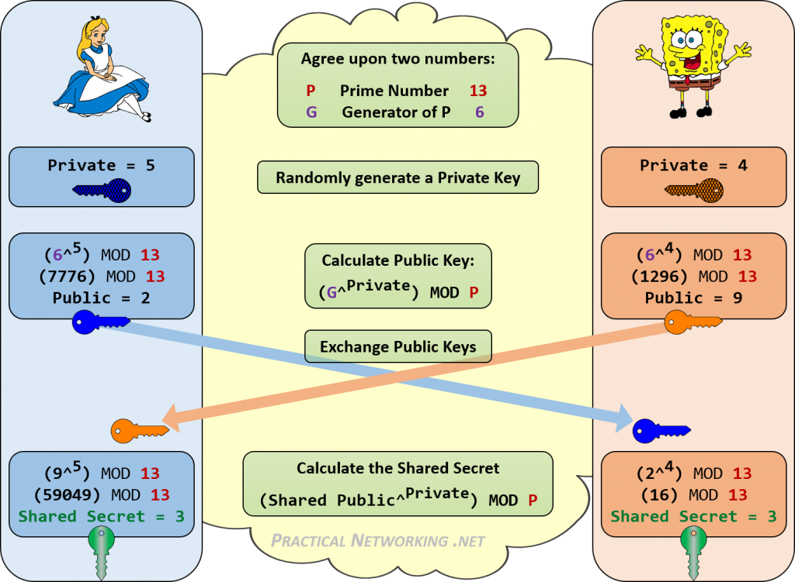

## HW02

* Deadline 2023-10-15 23:59:59

Implement Diffie-Hellman algorithm. Do not use any crypto helper libraries.

Implement prime number multiplication result factorization - ie find out p1 and p2 just 
by result of p1 * p2

Limit your work within positive LONG bits (64)

## Theory

The Diffie-Hellman key exchange is a way for people to secretly share information. 
When two people want to use cryptography, they often only have an insecure channel to exchange information. 
Martin Hellman, Whitfield Diffie and Ralph Merkle developed a protocol that allows this information exchange over an insecure channel. 
The resulting protocol has become known as Diffie-Hellman key exchange. 
Sometimes it is called Diffie-Hellman key agreement, Diffie-Hellman key establishment, Diffie-Hellman key negotiation or Exponential key exchange. 
Using this protocol, both parties agree on a secret key. They use this key to encrypt their communication using a symmetric-key cipher.

The scheme was first published by Whitfield Diffie and Martin Hellman in 1976. 
Diffie-Hellman key agreement itself is an anonymous (non-authenticated) key-agreement protocol, it provides the basis for a variety of authenticated protocols, and is used to provide perfect forward secrecy in Transport Layer Security’s short-lived modes.

