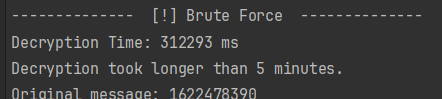

## MAX LONGINT
Depends of the 2 prime numbers (modulus n) and the public key size
for this values:

            long p = 40277       ;  // Prime number p
            long q = 40283       ;  // Prime number q
            long n = p * q;  // Modulus (n)
            long publicKey = 65537;  // 64 bits public key

            // Small cipher
            long encryptedNumber = 9223372036854775;

Max longint with this values may be some number around 9223372036854775 (Max long size), due to decrypt it takes arround 5:15 mins